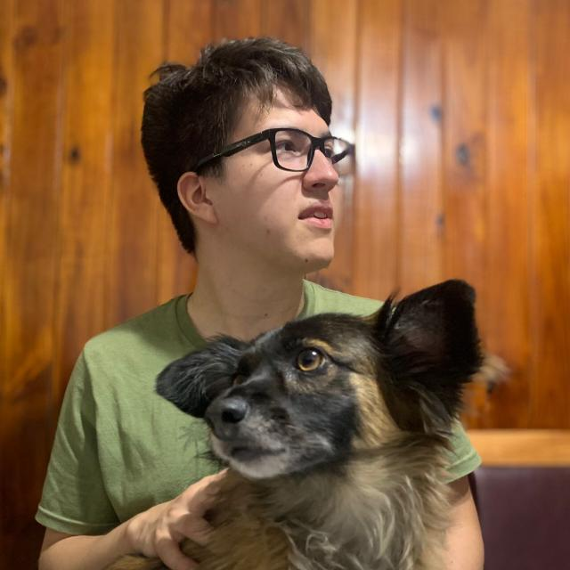

# *¡Hola!* Soy Luciano Castro

~~~
Tengo 21 años, vivo en Campana, me gusta el desarrollo de software y la electronica desde chico
Empecé a programar a los 18 haciendo cursos y de forma autodidacta.
Actualmente trabajo como desarrollador web mientras curso 2do año de ingeniería en sistemas
~~~

## Materias que curso este año
- Paradigmas de Programación
- Sintaxis y Semantica de los Lenguajes
- Analisis matemático 2
- Analisis de sistemas
- Arquitectura de computadoras

